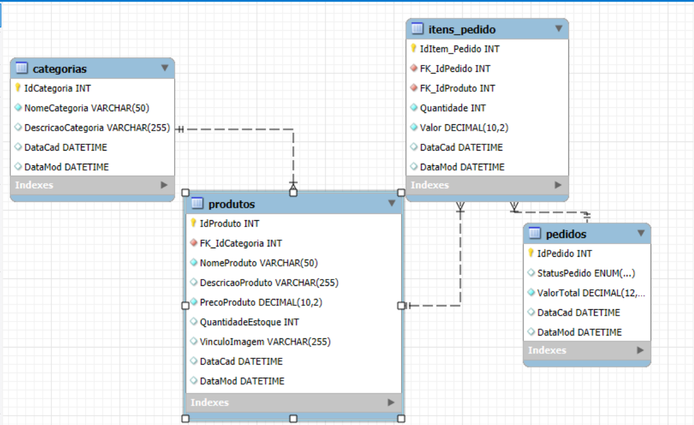

# 🏗️ Arquitetura do Sistema

Este documento descreve a arquitetura utilizada no sistema de E-commerce, seus componentes e responsabilidades.

# 📊 Visão Geral

## 📌 Descrição

O sistema segue uma arquitetura em camadas, separando responsabilidades entre front-end, back-end e banco de dados.

# 🧩 Camadas da Arquitetura

## 🌐 Frontend

### 📌 Responsabilidade
- Interface com o usuário
- Consumo da API

### 🛠️ Tecnologias
- React
- HTML / CSS / JavaScript

### 📦 Estrutura do Front-end

src/
 ├── assets/
 ├── components/
 ├── pages/
 ├── styles/
 ╰── App.js

## ⚙️ Backend

### 📌 Responsabilidade
- Regras de negócio
- Processamento de dados
- Exposição de API REST

### 🛠️ Tecnologias
- Node.js
- Express
- TypeScript

### 📦 Estrutura do Back-end

src/
 ├── configs/
 ├── controllers/
 ├── enum/
 ├── helpers/
 ├── middlewares/
 ├── models/
 ├── repositories/
 ╰── routes/

## 🗄️ Banco de Dados

### 📌 Responsabilidade
- Persistência dos dados

### 🛠️ Tecnologias
- SQLServer